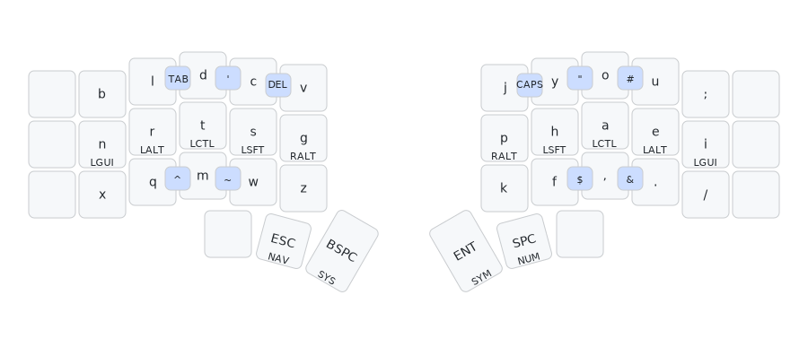
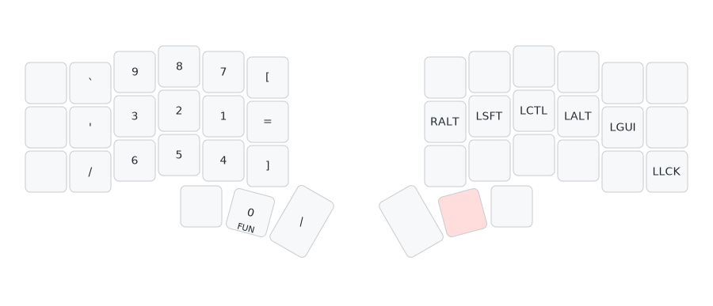
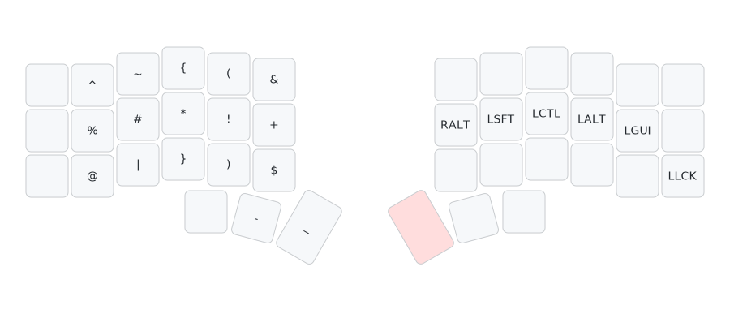
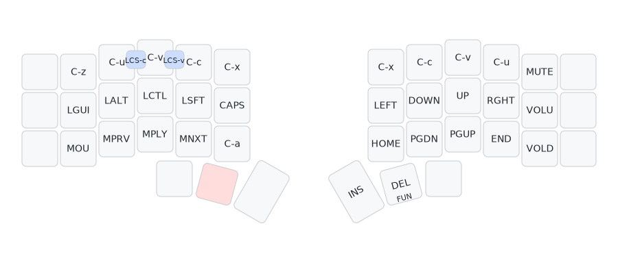
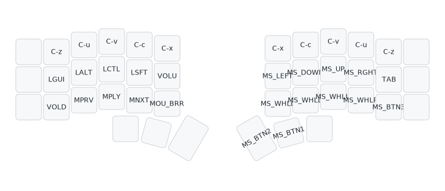
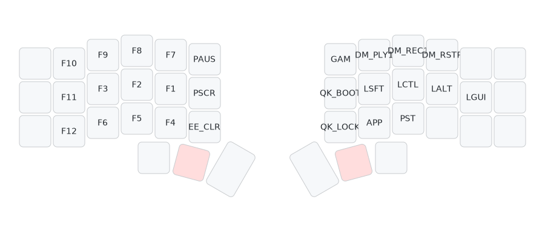
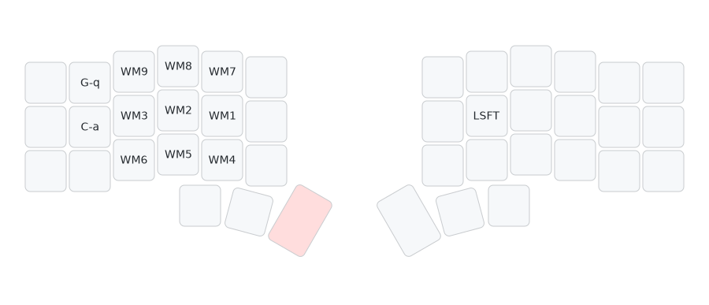
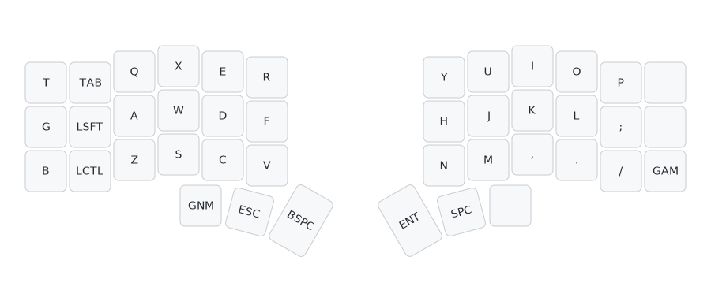
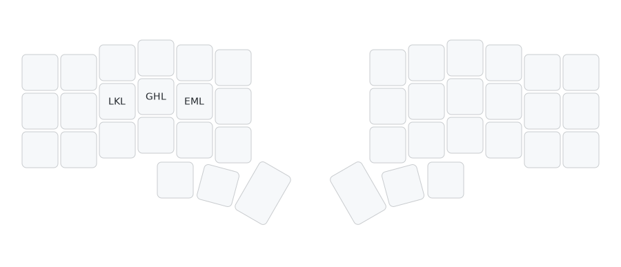

#+TITLE: naskbd -- QMK Userspace
#+DESCRIPTION: Colemak-DH keymap for the Corne (crkbd) split keyboard

Colemak-DH keymap for the *Corne (crkbd)* split keyboard, with home row mods, combos, mouse keys, and cedilla input.

* Keymaps

| Keymap           | Description                                  |
|------------------+----------------------------------------------|
| =naskbd=         | Primary daily driver -- Colemak-DH + HRMods  |
| =naskbd-gag=     | Meme keymap (monke, samara, ree)             |

* Layers
** BASE (Colemak-DH)

** NUM

** SYM

** NAV

** MOU (toggle)

** FUN

** SYS

WM keys send =GUI+N= (workspace switch). With =LSFT= held they send =C-a N= (tmux window switch).

** GAM (QWERTY, toggle from FUN)

Standard QWERTY layout for gaming. Toggle back with =TG(_GAM)= on the right bottom corner.

** PST (one-shot from FUN)

One-shot layer for pasting macros: LinkedIn URL, GitHub URL, email address.

* Combos

| Keys      | Output                    |
|-----------+---------------------------|
| W + F     | Tab                       |
| F + P     | '                         |
| C + D     | ^                         |
| L + U     | "                         |
| U + Y     | ~                         |
| X + C     | #                         |
| H + ,     | $                         |
| , + .     | &                         |
| J + L     | Caps Lock                 |
| P + B     | Delete                    |
| C-V + C-C | C-S-V (paste in terminal) |
| C-W + C-V | C-S-C (copy in terminal)  |

* Home Row Mods

#+begin_example
 a/GUI   r/ALT   s/CTL   t/SFT   g/RALT  |  m/RALT  n/SFT   e/CTL   i/ALT   o/GUI
#+end_example

- Tapping term: 180ms
- Quick tap term: 120ms
- Permissive hold enabled

* Custom Features

- *Mouse burst (BRR)* -- rapid-fire mouse clicks at 40ms intervals
- *Cedilla input* -- =RALT + ,= toggles cedilla mode for Portuguese characters (ã, õ, ão, ões)
- *Dynamic macros* -- record/play two slots, =Ctrl+REC1/PLY1= accesses slot 2 via key override
- *Layer reporting* -- sends current layer name over Raw HID to the host
- *Paste macros* -- =PST= one-shot layer outputs LinkedIn URL (=LKL=), GitHub URL (=GHL=), email (=EML=)

* Key Overrides

| Trigger        | Output  |
|----------------+---------|
| Ctrl + DM_REC1 | DM_REC2 |
| Ctrl + DM_PLY1 | DM_PLY2 |

* Config

| Setting            | Value |
|--------------------+-------|
| Master side        | Right |
| Tapping term       | 180ms |
| Quick tap term     | 120ms |
| Combo term         | 40ms  |
| Mouse BRR interval | 40ms  |

* Shared User Code

Located in =users/NasreddinHodja/=:

- =mouse_brr/= -- rapid click implementation
- =layer_report/= -- sends layer state over Raw HID

* Building

#+begin_src sh
# setup (once)
qmk setup
qmk config user.overlay_dir="$(realpath .)"

# compile
qmk compile -kb crkbd/rev1 -km naskbd

# or build all targets
qmk userspace-compile
#+end_src

Firmware is also built via GitHub Actions on push -- check the Releases tab for =.uf2= files.

* Generating diagram

Uses [[https://github.com/caksoylar/keymap-drawer][keymap-drawer]] to render =keymap.yaml= into SVG files.

#+begin_src sh
# regenerate all SVGs
cd ./diagram
./draw.sh
#+end_src
