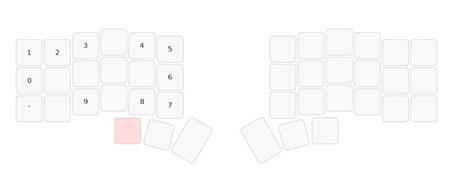
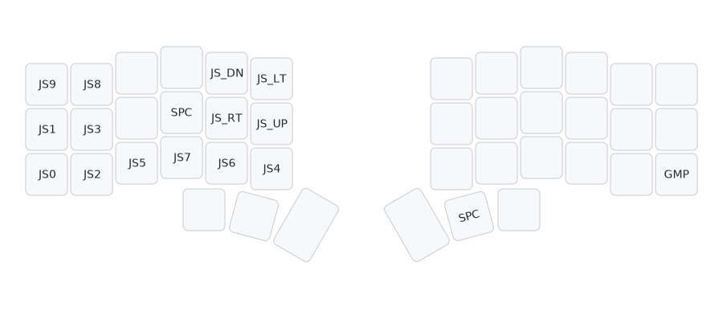

#+TITLE: naskbd -- QMK Userspace
#+DESCRIPTION: Gallium v2 keymap for the Corne (crkbd) split keyboard

Gallium v2 keymap (with Colemak punctuation positions for =, . / ;=) for the *Corne (crkbd)* split keyboard, with home row mods, combos, mouse keys, and cedilla input.

* Keymaps

| Keymap           | Description                                  |
|------------------+----------------------------------------------|
| =naskbd=         | Primary daily driver -- Gallium v2 (Colemak punctuation) + HRMods  |

* Layers
** BASE (Gallium v2)

[[./diagram/base.svg]]

** NUM

[[./diagram/num.svg]]

** SYM

[[./diagram/sym.svg]]

** NAV

[[./diagram/nav.svg]]

** MOU (toggle)

[[./diagram/mou.svg]]

** FUN

[[./diagram/fun.svg]]

** SYS

[[./diagram/sys.svg]]

WM keys send =GUI+N= (workspace switch). With =LSFT= held they send =C-a N= (tmux window switch).

** GAM (QWERTY, toggle from FUN)

[[./diagram/gam.svg]]

Standard QWERTY layout for gaming. Toggle back with =TG(_GAM)= on the right bottom corner.

** GNM (hold from GAM)

Number/extra keys overlay for GAM layer.

** GMP (toggle from FUN)

Gamepad layer: joystick buttons and D-pad hat (JS_UP/DN/LT/RT).

** PST (one-shot from FUN)

[[./diagram/pst.svg]]

One-shot layer for pasting macros: LinkedIn URL, GitHub URL, email address.

* Combos

| Keys      | Output    |
|-----------+-----------|
| L + D     | Tab       |
| D + C     | '         |
| Q + M     | ^         |
| Y + O     | "         |
| M + W     | ~         |
| O + U     | #         |
| F + ,     | $         |
| , + .     | &         |
| J + Y     | Caps Lock |
| C + V     | Delete    |
| C-V + C-C | C-S-V     |
| C-A + C-V | C-S-C     |

* Home Row Mods

#+begin_example
 n/GUI   r/ALT   t/CTL   s/SFT   g/RALT  |  p/RALT  h/SFT   a/CTL   e/ALT   i/GUI
#+end_example

- Tapping term: 180ms
- Quick tap term: 120ms
- Permissive hold enabled

* Custom Features

- *Mouse burst (BRR)* -- rapid-fire mouse clicks at 40ms intervals
- *Cedilla input* -- =RALT + ,= toggles cedilla mode for Portuguese characters (ã, õ, ão, ões)
- *Dynamic macros* -- record/play two slots, =Ctrl+REC1/PLY1= accesses slot 2 via key override
- *Layer reporting* -- sends current layer name over Raw HID to the host
- *Paste macros* -- =PST= one-shot layer outputs LinkedIn URL (=LKL=), GitHub URL (=GHL=), email (=EML=)

* Key Overrides

| Trigger        | Output  |
|----------------+---------|
| Ctrl + DM_REC1 | DM_REC2 |
| Ctrl + DM_PLY1 | DM_PLY2 |

* Config

| Setting            | Value |
|--------------------+-------|
| Master side        | Right |
| Tapping term       | 180ms |
| Quick tap term     | 120ms |
| Combo term         | 40ms  |
| Mouse BRR interval | 40ms  |

* Shared User Code

Located in =users/NasreddinHodja/=:

- =mouse_brr/= -- rapid click implementation
- =layer_report/= -- sends layer state over Raw HID

* Building

#+begin_src sh
# setup (once)
qmk setup
qmk config user.overlay_dir="$(realpath .)"

# compile
qmk compile -kb crkbd/rev1 -km naskbd

# or build all targets
qmk userspace-compile
#+end_src

* Generating diagram

Uses [[https://github.com/caksoylar/keymap-drawer][keymap-drawer]] to render =keymap.yaml= into SVG files.

#+begin_src sh
# regenerate all SVGs
cd ./diagram
./draw.sh
#+end_src
