#+TITLE: naskbd -- QMK Userspace
#+DESCRIPTION: Gallium v2 keymap for the Corne (crkbd) split keyboard

Gallium v2 keymap (with Colemak punctuation positions for =, . / ;=) for the Corne (crkbd) split keyboard.

* Layers
** BASE (Gallium v2)

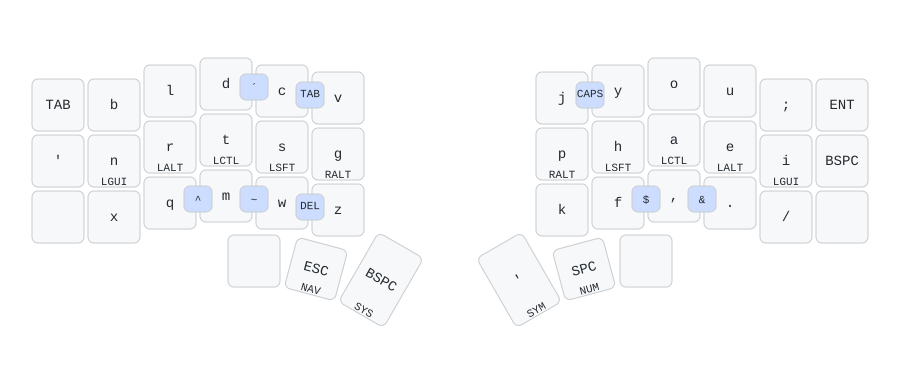

** NUM

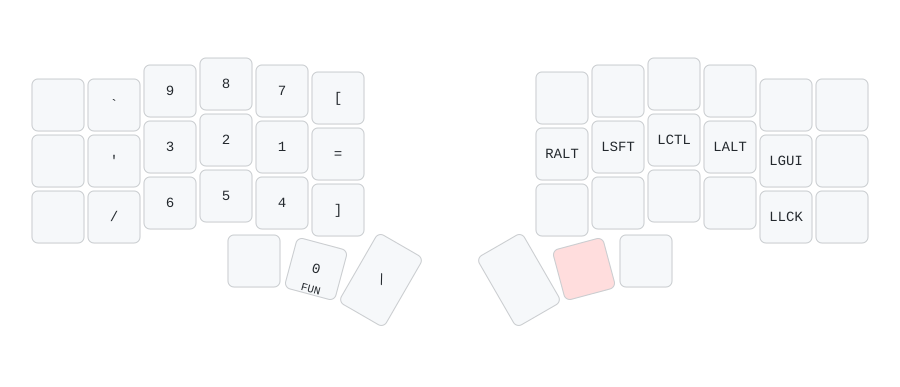

** SYM

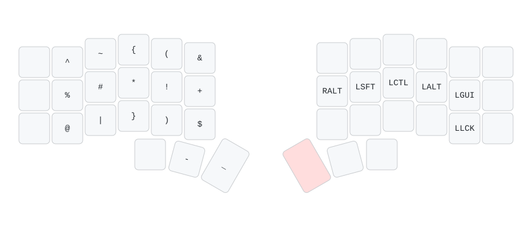

** NAV

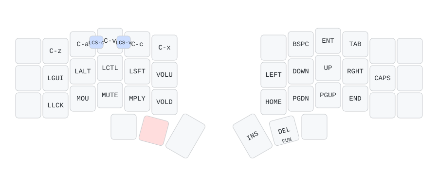

** MOU (toggle)

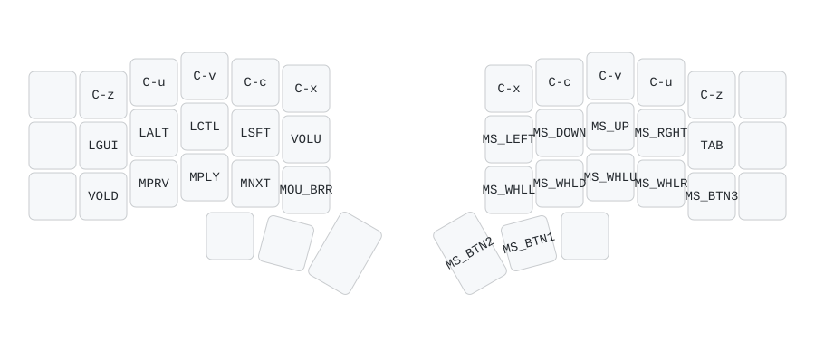

** FUN

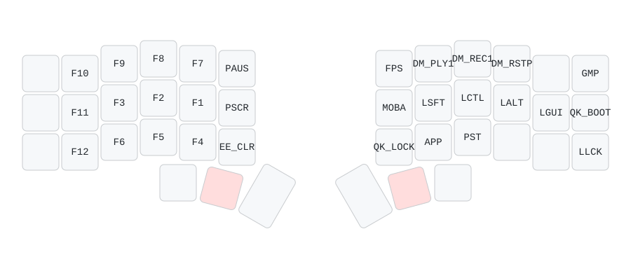

** SYS

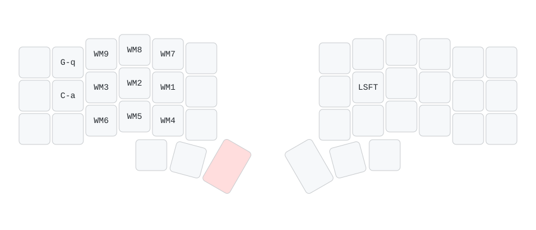

WM keys send =GUI+N= (workspace switch). With =LSFT= held they send =C-a N= (tmux window switch).

** FPS (QWERTY, toggle from FUN)

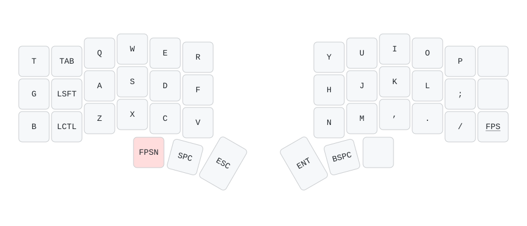

QWERTY layout for FPS games, shifted one column right so =WASD= sits under the left hand. Toggle back with =TG(_FPS)= on the right bottom corner.

** FPSN (hold from FPS)

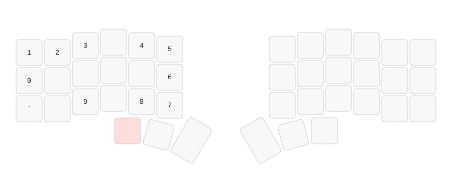

Number/extra keys overlay for the FPS layer.

** MOBA (QWERTY, toggle from FUN)

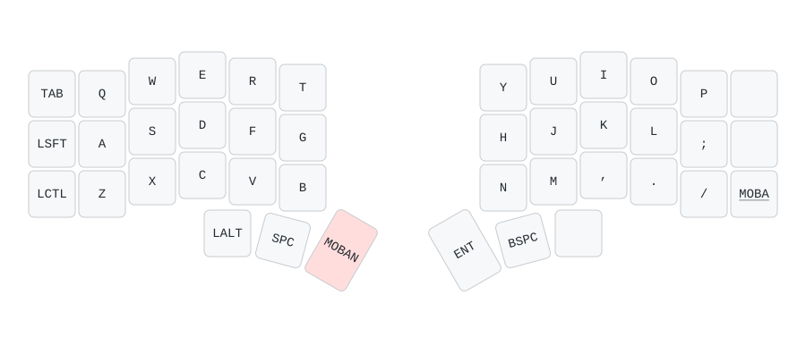

Straight QWERTY for MOBAs, with =TAB/LSFT/LCTL= on the outer column. Toggle back with =TG(_MOBA)= on the right bottom corner.

** MOBAN (hold from MOBA)

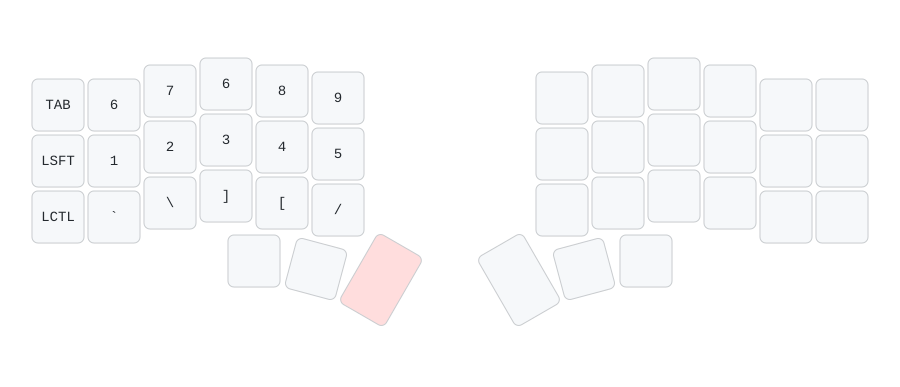

Number/item-slot overlay for the MOBA layer.

** GMP (toggle from FUN)

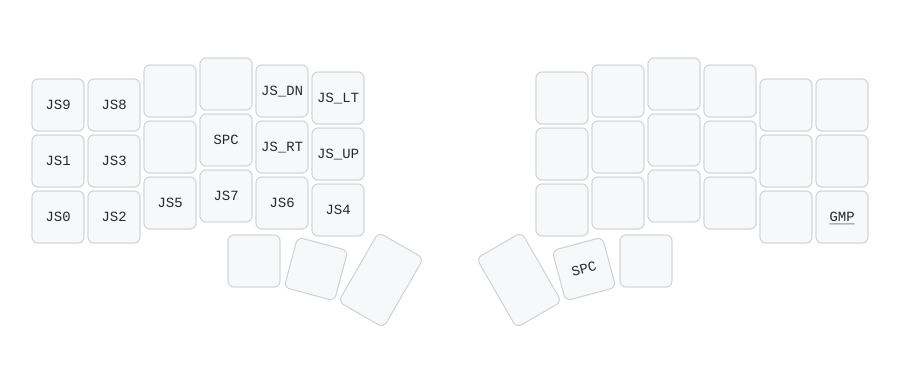

Gamepad layer: joystick buttons and D-pad hat (JS_UP/DN/LT/RT).

** PST (one-shot from FUN)

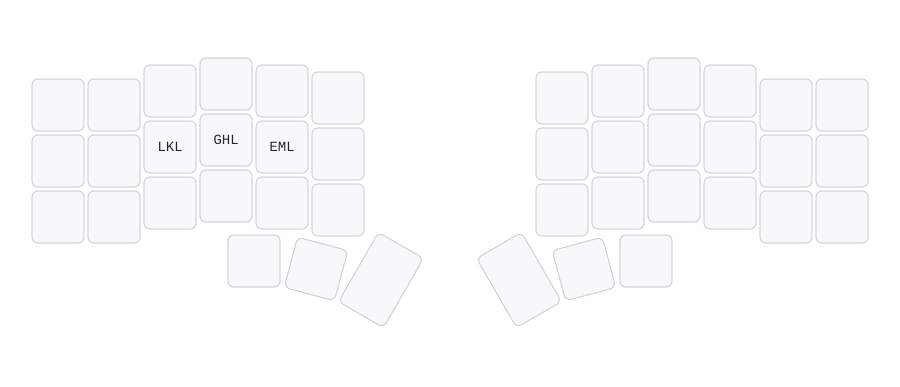

One-shot layer for pasting macros: LinkedIn URL, GitHub URL, email address.

* Combos

| Keys      | Output    |
|-----------+-----------|
| L + D     | Tab       |
| D + C     | '         |
| C + V     | Delete    |
| J + Y     | Caps Lock |
| Y + O     | $         |
| O + U     | &         |
| Q + M     | ^         |
| M + W     | ~         |
| C-V + C-C | C-S-V     |
| C-A + C-V | C-S-C     |

* Home Row Mods

#+begin_example
 n/GUI   r/ALT   t/CTL   s/SFT   g/RALT  |  p/RALT  h/SFT   a/CTL   e/ALT   i/GUI
#+end_example

- Tapping term: 180ms
- Quick tap term: 120ms
- Permissive hold enabled

* Custom Features

- *Mouse burst (BRR)* -- rapid-fire mouse clicks at 40ms intervals
- *Cedilla input* -- =RALT + ,= toggles cedilla mode for Portuguese characters (ã, õ, ão, ões)
- *Dynamic macros* -- record/play two slots, =Ctrl+REC1/PLY1= accesses slot 2 via key override
- *Layer reporting* -- sends current layer name over Raw HID to the host
- *Paste macros* -- =PST= one-shot layer outputs LinkedIn URL (=LKL=), GitHub URL (=GHL=), email (=EML=)

* Key Overrides

| Trigger        | Output  |
|----------------+---------|
| Ctrl + DM_REC1 | DM_REC2 |
| Ctrl + DM_PLY1 | DM_PLY2 |

* Config

| Setting            | Value |
|--------------------+-------|
| Master side        | Right |
| Tapping term       | 180ms |
| Quick tap term     | 120ms |
| Combo term         | 40ms  |
| Mouse BRR interval | 40ms  |

* Shared User Code

Located in =users/NasreddinHodja/=:

- =mouse_brr/= -- rapid click implementation
- =layer_report/= -- sends layer state over Raw HID

* Building
Setup (once):
#+begin_src sh
qmk setup
qmk config user.overlay_dir="$(realpath .)"
#+end_src

Build:
#+begin_src sh
qmk setup
qmk config user.overlay_dir="$(realpath .)"

# compile
qmk compile -kb crkbd/rev1 -km naskbd

# or build all targets
qmk userspace-compile
#+end_src

* Generating diagram

Uses [[https://github.com/caksoylar/keymap-drawer][keymap-drawer]] to render =keymap.yaml= into SVG files.

#+begin_src sh
# regenerate all SVGs
cd ./diagram
./draw.sh
#+end_src
